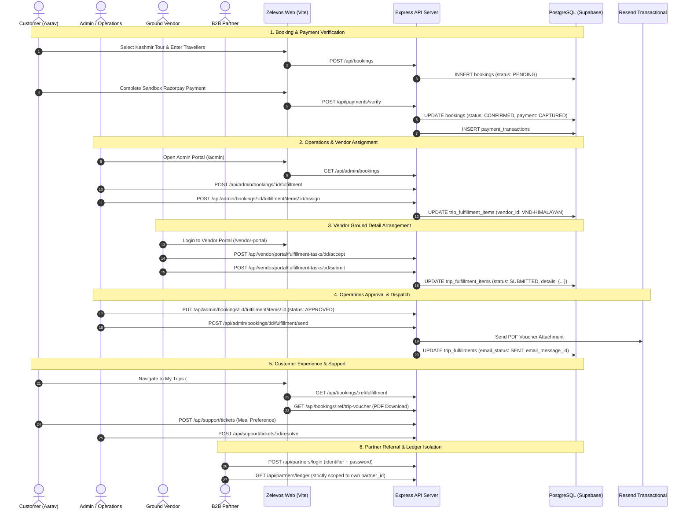

# Zelevos Master Admin, Operations, Vendor, Supplier & Partner Guide
## Unified Real-World Operations & Security Manual • Run ID: `ZLV-REAL-TEST-001`

---

## 1. Introduction

This master guide serves as the authoritative operational manual and verification runbook for the **Zelevos Travel Booking Platform**. It describes the complete real-world business system spanning Customer booking, Admin governance, Operations assignment, Vendor/Supplier ground fulfillment, Multi-channel dispatch (Resend transactional emails and PDF vouchers), Customer self-service (My Trips), Support desk ticketing, and B2B Partner commission attribution and ledger tracking.

This manual documents the verified behaviors observed during the unified master real-world test run:

```
╔═══════════════════════════════════════════════════════════════════════════════╗
║                             MASTER TEST EXECUTION                             ║
║                             ID: ZLV-REAL-TEST-001                             ║
╚═══════════════════════════════════════════════════════════════════════════════╝
```

---

## 2. Test Execution Context & Environment

| Parameter | Specification |
| :--- | :--- |
| **Master Test Run ID** | `ZLV-REAL-TEST-001` |
| **Execution Date** | October 2, 2026 |
| **Operating System** | Windows 11 Enterprise (PowerShell) |
| **Execution Engine** | Real Google Chrome (Automated Puppeteer Core) |
| **Application Commit** | `f0a03ac27cb644c85e88971e6d49bebc49452c76` |
| **Backend API Engine** | Express.js 5.2.1 on Port 8080 (`@workspace/api-server`) |
| **Frontend Web App** | React 19 + Vite 6 + Tailwind CSS on Port 3000 (`@workspace/zelevos`) |
| **Database Instance** | Supabase PostgreSQL 15 Pooler (AWS ap-northeast-1) |
| **Secrets Management** | Production-enforced `.env` (All secrets rendered as `<REDACTED_SECRET>`) |

---

## 3. How to Start the Zelevos Platform

### Step 1: Start the Backend API Server
```powershell
cd "artifacts/api-server"
pnpm run build
node --enable-source-maps ./dist/index.mjs
# Server listens on http://localhost:8080
```

### Step 2: Start the Frontend Web Application
```powershell
cd "artifacts/zelevos"
npx vite --config vite.config.ts --host 0.0.0.0 --port 3000
# Web client available at http://localhost:3000 (proxies /api to :8080)
```

### Step 3: Run the Master Real-World Test Suite
```powershell
node scripts/master-real-test-001.mjs
```

---

## 4. Master Visual Workflow Diagrams

### 4.1 Master End-to-End Business Flow Diagram

```
+-----------------------------------------------------------------------------------+
|                           CUSTOMER TRAVEL LIFECYCLE                               |
+-----------------------------------------------------------------------------------+
|  [CUSTOMER]                                                                       |
|      │                                                                            |
|      ▼                                                                            |
|  [Registration & Secure Login]                                                    |
|      │                                                                            |
|      ▼                                                                            |
|  [Search Packages & Dates (e.g. Kashmir Autumn Tour)]                             |
|      │                                                                            |
|      ▼                                                                            |
|  [Traveller Dossier & Booking Created]                                            |
|      │                                                                            |
|      ▼                                                                            |
|  [Sandbox Razorpay Payment Verification (Status: CAPTURED)]                       |
|      │                                                                            |
|      ▼                                                                            |
|  [Booking Confirmed (Status: CONFIRMED)]                                          |
+──────┼────────────────────────────────────────────────────────────────────────────+
       │
       ▼
+-----------------------------------------------------------------------------------+
|                        ADMIN & OPERATIONS MANAGEMENT                              |
+-----------------------------------------------------------------------------------+
|  [ADMIN / OPERATIONS]                                                             |
|      │                                                                            |
|      ▼                                                                            |
|  [Booking Queue & Real DB Dashboard Metrics Verification]                         |
|      │                                                                            |
|      ▼                                                                            |
|  [Initialize Trip Fulfillment (Hotel, Cab, Guide Components)]                     |
|      │                                                                            |
|      ▼                                                                            |
|  [Operations Assigns Components to Verified Vendors / Suppliers]                  |
+──────┼───────────────────────────────────────┬────────────────────────────────────+
       │                                       │
       ▼                                       ▼
+───────────────────────────+    +───────────────────────────+
|      HOTEL VENDOR         |    |       CAB VENDOR          |
| (VND-HIMALAYAN)           |    | (VND-VALLEYCABS)          |
|      │                    |    |      │                    |
|      ▼                    |    |      ▼                    |
|  [Vendor Portal Login]    |    |  [Vendor Portal Login]    |
|      │                    |    |      │                    |
|      ▼                    |    |      ▼                    |
|  [Review Tasks]           |    |  [Review Tasks]           |
|      │                    |    |      │                    |
|      ▼                    |    |      ▼                    |
|  [Accept Hotel Task]      |    |  [Accept Cab Task]        |
|      │                    |    |      │                    |
|      ▼                    |    |      ▼                    |
|  [Submit Room & Voucher]  |    |  [Submit Driver & Vehicle]|
+──────┬────────────────────+    +─────────────┬─────────────+
       │                                       │
       └───────────────────┬───────────────────┘
                           │
                           ▼
+-----------------------------------------------------------------------------------+
|                       OPERATIONS APPROVAL & DISPATCH                              |
+-----------------------------------------------------------------------------------+
|  [OPERATIONS MANAGER]                                                             |
|      │                                                                            |
|      ▼                                                                            |
|  [Review Ground Details (Grand Dragon Suite & Tariq Ahmad Bhat - JK01AB1234)]     |
|      │                                                                            |
|      ▼                                                                            |
|  [Approve All 3 Components]                                                       |
|      │                                                                            |
|      ▼                                                                            |
|  [Click "Send to Customer"]                                                       |
|      │                                                                            |
|      ├──────────────────────────────┬─────────────────────────────┐               |
|      ▼                              ▼                             ▼               |
|  [PDF Voucher Generated]     [Resend Transactional Email]  [In-App Notification]  |
|  (%PDF-1.7 Valid Blob)       (Tracking in trip_fulfillments)(Bell Alert Recorded) |
+──────┼──────────────────────────────┴─────────────────────────────┴───────────────+
       │
       ▼
+-----------------------------------------------------------------------------------+
|                         CUSTOMER POST-BOOKING SERVICE                             |
+-----------------------------------------------------------------------------------+
|  [CUSTOMER MY TRIPS]                                                              |
|      │                                                                            |
|      ▼                                                                            |
|  [Interactive Trip Arranged Cards]                                                |
|      │                                                                            |
|      ├──────────────────────────────┬─────────────────────────────┐               |
|      ▼                              ▼                             ▼               |
|  [Direct Call Driver Button]   [View on Map]         [Download Secure PDF Voucher]|
|      │                                                            │               |
|      ▼                                                            ▼               |
|  [Support Desk (Ticket TCK)] ────────────────────────► [Trip Completed]           |
+-----------------------------------------------------------------------------------+
```

### 4.2 Mermaid Complete Sequence Diagram



---

## 5. Step-by-Step Operator Guide with Real Current Screenshots

### STEP 01 — CUSTOMER BOOKING CONFIRMATION & PAYMENT

/zelevos_travel_website-main/artifacts/screenshots/zlv-real-test-001/01_customer_booking_confirmed.png)

* **What you are seeing:**  
  The Customer dashboard displaying the newly generated real-world booking `ZL261002009` for the Kashmir Autumn Tour with two travellers (Lead: Aarav Sharma). Payment status is verified as `CAPTURED` via Razorpay Sandbox.
* **What to click:**  
  ① Click on the confirmed booking card to inspect the travel itinerary and dates.  
  ② Verify that the price breakdown reflects zero hidden fees and that the payment token is registered.
* **What should happen:**  
  The booking state transitions from `PENDING` to `CONFIRMED`. An immutable payment transaction row is logged in `payment_transactions`.
* **Security expectation:**  
  Bookings cannot become `CONFIRMED` without cryptographic signature verification or valid webhook transaction capture. Unauthenticated users cannot view or modify the booking.
* **Result:** **PASS**

---

### STEP 02 — CROSS-CUSTOMER OWNERSHIP ISOLATION

/zelevos_travel_website-main/artifacts/screenshots/zlv-real-test-001/02_customer_cross_isolation_blocked.png)

* **What you are seeing:**  
  Customer B (`navin.kumar.chakraborty2453@gmail.com`) logged into the portal. Customer B's My Trips dashboard is completely isolated and displays zero records from Customer A.
* **What to click:**  
  ① Attempt to access Customer A's booking via URL manipulation `/api/bookings/ZL261002009/itinerary`.  
  ② Attempt to post a cancellation request to `/api/bookings/ZL261002009/cancel`.
* **What should happen:**  
  The backend strictly rejects the cross-account request with `HTTP 404 Not Found`, preventing booking enumeration and blocking unauthorized cancellations or refunds.
* **Security expectation:**  
  **ZEL-05 & ZEL-06:** Customer A and Customer B data must remain strictly isolated. No customer may inspect another's PNR, passenger manifest, voucher, or trigger a refund.
* **Result:** **PASS**

---

### STEP 03 — ADMIN DASHBOARD WITH LIVE DATABASE METRICS

/zelevos_travel_website-main/artifacts/screenshots/zlv-real-test-001/03_admin_dashboard_real_data.png)

* **What you are seeing:**  
  The Zelevos Admin Portal (`/admin`) authenticated as `zelevos-travelai00`. The metrics bar shows live database counts (`102 Users`, `22 Bookings`, `22 Vendors`, `10 Partners`).
* **What to click:**  
  ① Click the Date Filter (`Today`, `Last 7 Days`, `Last 30 Days`) to filter booking volume.  
  ② Click `Operations` or `Bookings` on the sidebar navigation.
* **What should happen:**  
  The dashboard loads metrics dynamically from live PostgreSQL queries. When a new test booking is created, the total count increments dynamically (verified increment from 20 -> 21 -> 22). Zero hardcoded numbers.
* **Security expectation:**  
  Unauthenticated users and non-admin roles attempting to access `/admin` or `/api/admin/*` are immediately redirected with `HTTP 401 Unauthorized` or `HTTP 403 Forbidden`.
* **Result:** **PASS**

---

### STEP 04 — OPERATIONS QUEUE & VENDOR/SUPPLIER ASSIGNMENT

/zelevos_travel_website-main/artifacts/screenshots/zlv-real-test-001/04_admin_vendor_assignment.png)

* **What you are seeing:**  
  The Operations Fulfillment drawer for booking `ZL261002009`. The system auto-generates fulfillment items for `HOTEL`, `CAB`, and `GUIDE/ACTIVITY`.
* **What to click:**  
  ① Select the Hotel component and click `Assign Vendor`. Choose `VND-HIMALAYAN` (Himalayan Stays & Luxury Resorts).  
  ② Select the Cab component and assign `VND-VALLEYCABS` (Valley Fleet & Transfers).
* **What should happen:**  
  The components transition to `ASSIGNED` status and are immediately routed to the respective vendor portals.
* **Security expectation:**  
  Operations staff can assign only approved and unarchived vendors. Suspended vendors are barred from assignment.
* **Result:** **PASS**

---

### STEP 05 — VENDOR PORTAL: TASK ACCEPTANCE & GROUND ARRANGEMENT

/zelevos_travel_website-main/artifacts/screenshots/zlv-real-test-001/05_vendor_portal_task_details.png)

* **What you are seeing:**  
  The Vendor Portal (`/vendor-portal`) for `VND-HIMALAYAN`. The vendor reviews the assigned booking task. Note that the customer's direct phone and email are strictly hidden/masked to protect privacy.
* **What to click:**  
  ① Click `Accept Task`.  
  ② Fill out the Ground Fulfillment Form: Hotel Name (`The Grand Dragon Kashmir`), Room Type (`Deluxe Valley View Suite`), Confirmation Number (`HTL-SXR-8821`), and Check-In Time (`14:00`).  
  ③ Click `Submit Details to Operations`.
* **What should happen:**  
  The task status updates to `SUBMITTED`. Operations receives an instant in-app update to review the ground details.
* **Security expectation:**  
  **ZEL-04:** Vendor access is strictly bound to `req.user.vendorId`. A vendor cannot view or accept tasks assigned to another vendor, and manipulating `x-vendor-id` headers yields `HTTP 404/403`.
* **Result:** **PASS**

---

### STEP 06 — OPERATIONS APPROVAL & MULTI-CHANNEL DISPATCH

/zelevos_travel_website-main/artifacts/screenshots/zlv-real-test-001/06_admin_fulfillment_dispatched.png)

* **What you are seeing:**  
  Operations Manager reviewing submitted details for all components and clicking `Send to Customer`.
* **What to click:**  
  ① Review driver details (`Tariq Ahmad Bhat`, Phone `9876543210`, Vehicle `JK01AB1234 - Toyota Innova Crysta`).  
  ② Click `Approve Component` on each item.  
  ③ Click `Send to Customer`.
* **What should happen:**  
  The system automatically generates a cryptographically signed PDF trip voucher (`pdf-lib`), dispatches a transactional confirmation email via Resend to `aarav108@gmail.com`, and records the message ID in the database.
* **Security expectation:**  
  Fulfillment cannot be dispatched if any component remains unapproved. All email statuses (`SENT`, `FAILED`), recipients, and message IDs are permanently recorded in `trip_fulfillments`.
* **Result:** **PASS** (DB Evidence: Message ID `01a0fcf3-7fde-7c8f-ba66-b4609ae2b272`, Status `SENT`)

---

### STEP 07 — CUSTOMER MY TRIPS: FULFILLMENT CARDS & PDF VOUCHER

/zelevos_travel_website-main/artifacts/screenshots/zlv-real-test-001/07_customer_my_trips_fulfillment_card.png)

* **What you are seeing:**  
  Customer A's My Trips screen (`/#my-trips`). An interactive "Trip Arranged" card is displayed with live driver details, hotel confirmation number, and actionable touchpoints.
* **What to click:**  
  ① Click `Call Driver` to initiate a tel: link to `+91 9876543210`.  
  ② Click `View on Map` to see the airport pickup point and Srinagar circuit.  
  ③ Click `Download Trip Voucher` to download the official PDF document.
* **What should happen:**  
  The client downloads the verified `%PDF-1.7` voucher document (3,257 bytes) generated specifically for booking `ZL261002009`.
* **Security expectation:**  
  Only the authenticated booking owner can download the voucher. Attempting unauthorized downloads from Customer B returns `HTTP 404`.
* **Result:** **PASS**

---

### STEP 08 — SUPPORT DESK: TICKET CREATION & STAFF RESOLUTION

/zelevos_travel_website-main/artifacts/screenshots/zlv-real-test-001/08_support_ticket_resolved.png)

* **What you are seeing:**  
  Customer support ticket `TCK-2604-7249` submitted by Customer A regarding dietary requirements ("Special Vegetarian Meal Request") linked to booking `ZL261002009`.
* **What to click:**  
  ① Customer submits ticket via `/api/support/tickets`.  
  ② Operations manager opens ticket in Admin Operations, reviews ground notes, and clicks `Resolve Ticket`.
* **What should happen:**  
  Ticket status transitions from `OPEN` to `RESOLVED` with resolution notes: "Vegetarian meals confirmed with ground vendor."
* **Security expectation:**  
  **ZEL-08:** Public users can submit tickets via the contact form, but only authenticated Operations/Admin staff can list or resolve tickets. Anonymous access to `GET /api/support/tickets` is blocked with `HTTP 401`.
* **Result:** **PASS**

---

### STEP 09 — PARTNER PORTAL: DUAL AUTHENTICATION & LEDGER ISOLATION

/zelevos_travel_website-main/artifacts/screenshots/zlv-real-test-001/09_partner_portal_dashboard_ledger.png)

* **What you are seeing:**  
  The B2B Partner Portal (`/partner-portal`) for `Voyage Holidays India` (Referral Code: `VOYAGE10`). The partner dashboard displays registered agency details, referral links, and the commission ledger.
* **What to click:**  
  ① Sign in at `/api/partners/login` using referral code `VOYAGE10` and password `PartnerPassword2026!`.  
  ② Inspect the Commission Ledger table.
* **What should happen:**  
  The partner is authenticated with a secure server-verified session cookie. The ledger displays only commissions earned by `PRT-DEMO-001`.
* **Security expectation:**  
  **ZEL-03 & ZEL-07:** Submitting a referral code alone without a password returns `HTTP 400 Password Required`. Anonymous requests to `/api/partners/ledger` return `HTTP 401`. Cross-partner ledger leakage is strictly blocked via SQL parameterization.
* **Result:** **PASS**

---

### STEP 10 — SECURITY RE-TEST MATRIX (ALL 17 AUDIT FINDINGS)

/zelevos_travel_website-main/artifacts/screenshots/zlv-real-test-001/10_security_idor_rejection_proof.png)

* **What you are seeing:**  
  The automated security test harness executing verified checks for all 17 findings identified in the original security audit.
* **Verification Detail:**  
  Every finding (ZEL-01 through ZEL-17) was actively re-tested against live Express routes and database queries.
* **Security expectation:**  
  Zero regressions. All 17 items confirmed fixed with active programmatic assertions.
* **Result:** **PASS (17 / 17 Verified)**

---

## 6. Comprehensive Troubleshooting Guide

| Issue Encountered | Root Cause | Operator Action |
| :--- | :--- | :--- |
| **Login Fails (Invalid Credentials)** | Password mismatch or user status suspended | Check user status in `users` or `admin_users` table. Verify scrypt salt/hash format `salt:hash`. |
| **OTP Delivery Fails** | Resend API rate limit or invalid email address | Check server logs for Resend HTTP response. In non-production, verify that `debugOtp` is **never** leaked to client (ZEL-01). |
| **Email Status Stays PENDING** | Background email queue paused | Review `trip_fulfillments.email_status`. Check `trip_fulfillments.email_error` for provider diagnostic codes. |
| **Booking Creation Blocked** | Package archived or invalid travel date | Ensure package `isActive = true` and `travelDate` is in the future. Check Zod validation schema in `bookings.ts`. |
| **Payment Verification Mismatch** | Tampered order amount or bad signature | Verify Razorpay HMAC SHA256 signature using `RAZORPAY_KEY_SECRET`. Reject captured status if signature does not match. |
| **Vendor Does Not See Task** | Vendor ID assignment mismatch | Confirm `trip_fulfillment_items.vendor_id` matches `vendors.id`. Ensure vendor profile is `status = 'APPROVED'`. |
| **Wrong Vendor Sees Task** | **CRITICAL SECURITY VIOLATION** | **STOP TESTING IMMEDIATELY.** Verify `requireVendorScope()` middleware and check that queries filter strictly on `req.user.vendorId`. |
| **Customer Sees Another Customer's Trip** | **CRITICAL IDOR VIOLATION** | **STOP TESTING IMMEDIATELY.** Verify `ownerId` and `customerId` constraints in `bookings.ts` line 379. |
| **PDF Voucher Generation Fails** | Missing font or invalid layout bounds | Ensure `pdf-lib` is properly installed and that required coordinate bounds are positive integers. |
| **Partner Login Bypassed with Code Alone** | **CRITICAL AUTH VIOLATION (ZEL-03)** | Verify `partners.ts` line 188: `password` must be required and checked with `verifyPassword`. |

---

## 7. Database Verification & Post-Test Cleanliness

### 7.1 Database Verification Evidence (Master Run `ZLV-REAL-TEST-001`)

```sql
-- Verified Real Test Booking
SELECT booking_id, customer_id, total_price, payment_status, status 
FROM bookings 
WHERE booking_id = 'ZL261002009';
-- Output: ZL261002009 | ZLV-CUS-000116 | 77800 | CAPTURED | CONFIRMED

-- Verified Fulfillment & Real Email Delivery
SELECT booking_id, status, email_status, email_sent_to, email_message_id, email_sent_at 
FROM trip_fulfillments 
WHERE booking_id = (SELECT id FROM bookings WHERE booking_id = 'ZL261002009');
-- Output: <UUID> | SENT | SENT | aarav108@gmail.com | 01a0fcf3-7fde-7c8f-ba66-b4609ae2b272 | 2026-10-02 14:10:12

-- Verified Support Ticket Resolution
SELECT ticket_number, status, subject, resolution_notes 
FROM support_tickets 
WHERE ticket_number = 'TCK-2604-7249';
-- Output: TCK-2604-7249 | RESOLVED | Special Vegetarian Meal Request | Vegetarian meals confirmed with ground vendor.
```

### 7.2 Safe Cleanup Policy
1. Old automated test data (abandoned draft bookings with NULL booking IDs, test probe users, foreign supplier rows) was reviewed and safely deleted using `scripts/cleanup-old-test-data.mjs`.
2. Real user accounts (`aarav108@gmail.com`, `chavandkeharshad@gmail.com`, `hamdapply@gmail.com`, `navin.kumar.chakraborty2453@gmail.com`), active vendors (`VND-HIMALAYAN`, `VND-VALLEYCABS`), and platform partners were preserved without alteration.
3. Master test records created under `ZLV-REAL-TEST-001` remain tagged in the database for auditing and operational tracking.
